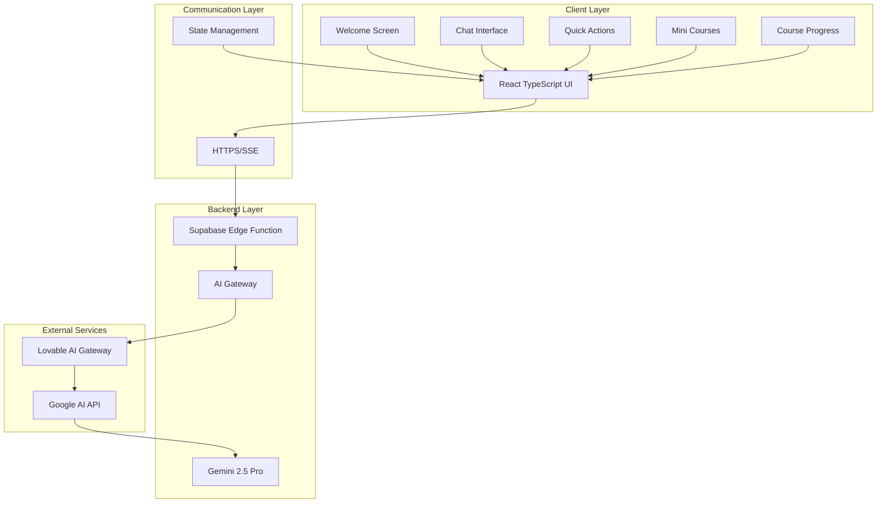
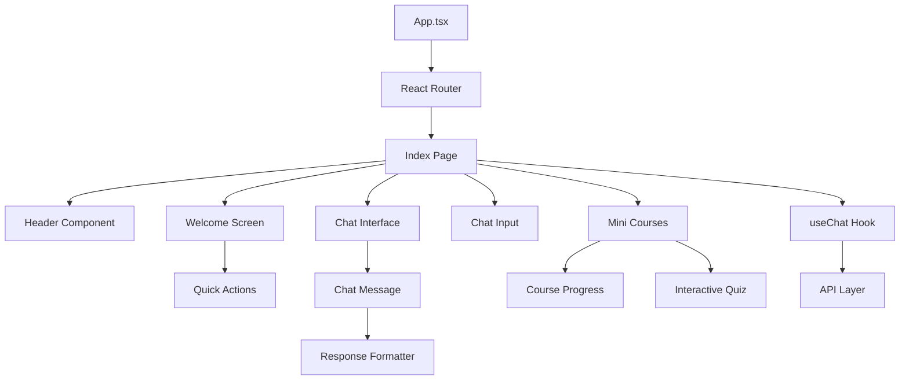
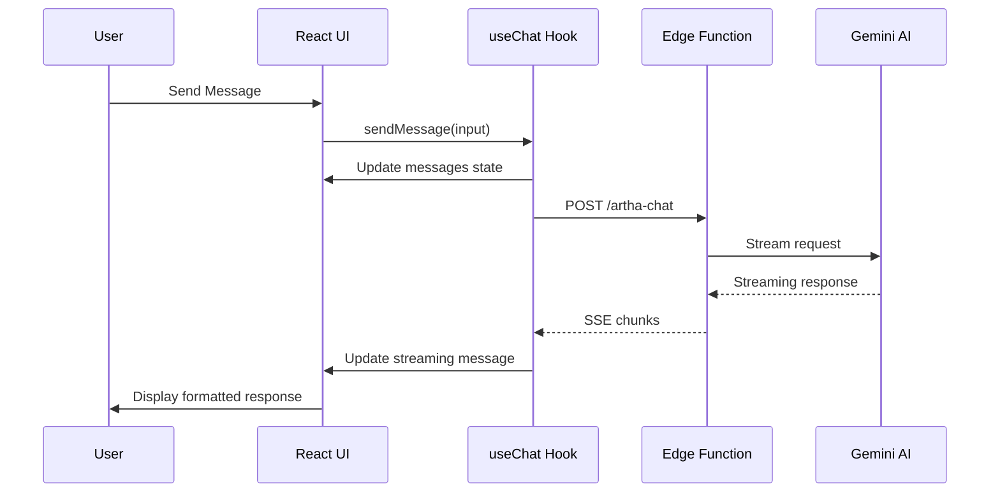
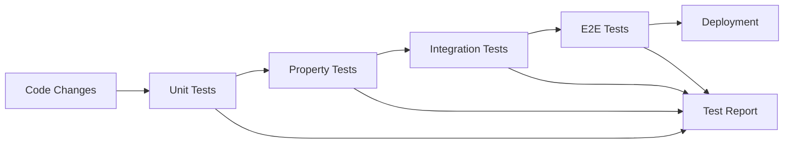

 # Design Document

## Overview

ArthaAI is a sophisticated AI-powered financial advisory chatbot developed for the AWS AI for Bharat hackathon, designed to democratize financial literacy and advisory services across India. The system combines modern web technologies with advanced AI capabilities to deliver real-time, structured financial advice and education through an intuitive chat interface.

The architecture follows a client-server pattern with a React TypeScript frontend and Supabase Edge Functions backend, powered by Google's Gemini 2.5 Pro model. The design emphasizes ethical AI practices, regulatory compliance, user safety, and comprehensive financial education through built-in guardrails, structured response formatting, and interactive learning modules.

**AWS AI for Bharat Hackathon Alignment:**
- **Democratizing Financial Services**: Making CA-grade financial advice accessible to all Indians regardless of economic background
- **AI-Powered Education**: Leveraging advanced AI to provide personalized financial literacy through interactive mini courses
- **Inclusive Design**: Supporting diverse Indian contexts, languages, and financial situations
- **Scalable Architecture**: Built for nationwide deployment using cloud-native technologies
- **Social Impact**: Addressing financial inclusion and literacy gaps across urban and rural India

Key design principles include:
- **Real-time streaming responses** for immediate user feedback
- **Adaptive response depth** matching user needs and query complexity  
- **Ethical guardrails** preventing harmful financial advice
- **Indian financial context** with RBI, SEBI, and tax regulation awareness
- **Scam detection** and fraud pattern recognition
- **Professional-grade analysis** structured like CA consultations
- **Interactive learning modules** for comprehensive financial education
- **Progress tracking** and certification for educational achievements

## Architecture

### High-Level Architecture



### Component Architecture

The frontend follows a component-based architecture with clear separation of concerns:



### Data Flow Architecture



## Components and Interfaces

### Core Components

#### 1. Chat Interface (`ChatInterface`)
**Purpose**: Main conversation interface managing message display and user interactions

**Key Responsibilities**:
- Message history management and display
- Real-time streaming response rendering
- Auto-scrolling to latest messages
- Loading state management
- Error handling and recovery

**Interface**:
```typescript
interface ChatInterfaceProps {
  messages: Message[];
  isLoading: boolean;
  onSend: (message: string) => void;
  onClear: () => void;
}

interface Message {
  role: "user" | "assistant";
  content: string;
  timestamp?: Date;
}
```

#### 2. Welcome Screen (`WelcomeScreen`)
**Purpose**: Initial user interface showcasing features and providing quick access to common scenarios

**Key Responsibilities**:
- Feature presentation and value proposition
- Quick action button management
- Trust indicator display
- Smooth transition to chat interface

**Interface**:
```typescript
interface WelcomeScreenProps {
  onQuickAction: (prompt: string) => void;
}

interface Feature {
  icon: LucideIcon;
  title: string;
  description: string;
}
```

#### 3. Quick Actions (`QuickActions`)
**Purpose**: Pre-defined prompts for common financial advisory scenarios

**Key Responsibilities**:
- Action categorization and presentation
- Contextual prompt generation
- Visual distinction through icons and colors
- Accessibility and responsive design

**Interface**:
```typescript
interface QuickActionsProps {
  onSelect: (prompt: string) => void;
}

interface QuickAction {
  icon: LucideIcon;
  label: string;
  description: string;
  prompt: string;
  color: string;
  bgColor: string;
}
```

#### 4. Response Formatter (`ResponseFormatter`)
**Purpose**: Structures AI responses into readable, professional sections

**Key Responsibilities**:
- Section parsing and identification
- Visual styling for different content types
- Icon and color coding for sections
- Preservation of formatting and line breaks

**Interface**:
```typescript
interface ResponseFormatterProps {
  content: string;
  isStreaming?: boolean;
}

interface ResponseSection {
  type: 'understanding' | 'facts' | 'risks' | 'analysis' | 'recommendation' | 'alert';
  content: string;
  icon: LucideIcon;
  styling: string;
}
```

#### 5. Chat Input (`ChatInput`)
**Purpose**: User input interface with auto-resize and submission handling

**Key Responsibilities**:
- Multi-line text input with auto-resize
- Keyboard shortcut handling (Enter to send)
- Loading state indication
- Input validation and sanitization

**Interface**:
```typescript
interface ChatInputProps {
  onSend: (message: string) => void;
  isLoading: boolean;
  placeholder?: string;
}
```

#### 6. Mini Courses (`MiniCourses`)
**Purpose**: Interactive educational modules for comprehensive financial literacy

**Key Responsibilities**:
- Course catalog management and display
- Module progression and navigation
- Interactive content delivery
- Progress tracking and analytics
- Certificate generation upon completion

**Interface**:
```typescript
interface MiniCoursesProps {
  onCourseSelect: (courseId: string) => void;
  userProgress: CourseProgress[];
}

interface Course {
  id: string;
  title: string;
  description: string;
  category: 'budgeting' | 'investing' | 'taxation' | 'insurance' | 'retirement';
  difficulty: 'beginner' | 'intermediate' | 'advanced';
  modules: CourseModule[];
  estimatedDuration: number;
  prerequisites?: string[];
}

interface CourseModule {
  id: string;
  title: string;
  content: string;
  exercises: Exercise[];
  quiz: Quiz;
  resources: Resource[];
}
```

#### 7. Course Progress (`CourseProgress`)
**Purpose**: Tracks user learning progress and achievements

**Key Responsibilities**:
- Progress state management
- Quiz score tracking
- Time spent analytics
- Completion status updates
- Certificate generation

**Interface**:
```typescript
interface CourseProgressProps {
  courseId: string;
  userId: string;
  onProgressUpdate: (progress: ProgressUpdate) => void;
}

interface ProgressUpdate {
  moduleId: string;
  completed: boolean;
  score?: number;
  timeSpent: number;
  timestamp: Date;
}

interface UserProgress {
  courseId: string;
  completedModules: string[];
  currentModule: string;
  overallScore: number;
  totalTimeSpent: number;
  certificateEarned: boolean;
  startDate: Date;
  completionDate?: Date;
}
```

#### 8. Interactive Learning (`InteractiveLearning`)
**Purpose**: Delivers engaging educational content with hands-on exercises

**Key Responsibilities**:
- Interactive quiz management
- Scenario-based learning
- Real-time feedback provision
- Adaptive difficulty adjustment
- Performance analytics

**Interface**:
```typescript
interface InteractiveLearningProps {
  module: CourseModule;
  onComplete: (results: LearningResults) => void;
}

interface Quiz {
  id: string;
  questions: Question[];
  passingScore: number;
  timeLimit?: number;
}

interface Question {
  id: string;
  type: 'multiple-choice' | 'true-false' | 'scenario' | 'calculation';
  question: string;
  options?: string[];
  correctAnswer: string | number;
  explanation: string;
  difficulty: number;
}

interface Exercise {
  id: string;
  type: 'calculation' | 'scenario' | 'planning' | 'analysis';
  title: string;
  description: string;
  template?: any;
  solution: any;
}
```

#### 1. Edge Function Handler (`artha-chat`)
**Purpose**: Serverless function processing chat requests and managing AI interactions

**Key Responsibilities**:
- Request validation and sanitization
- AI model integration and prompt management
- Streaming response handling
- Error management and rate limiting
- CORS and security headers

**Interface**:
```typescript
interface ChatRequest {
  messages: Message[];
}

interface ChatResponse {
  choices: {
    delta: {
      content?: string;
    };
  }[];
}
```

#### 2. AI Integration Layer
**Purpose**: Abstraction layer for AI model interactions

**Key Responsibilities**:
- Prompt engineering and system message management
- Model configuration and parameter tuning
- Response streaming and chunk processing
- Error handling and fallback mechanisms

### State Management

#### useChat Hook
**Purpose**: Central state management for chat functionality

**State Structure**:
```typescript
interface ChatState {
  messages: Message[];
  isLoading: boolean;
  error: string | null;
}

interface ChatActions {
  sendMessage: (input: string) => Promise<void>;
  clearChat: () => void;
  retryLastMessage: () => Promise<void>;
}
```

**Key Features**:
- Optimistic UI updates
- Streaming response accumulation
- Error recovery mechanisms
- Message persistence during session

## Data Models

### Message Model
```typescript
interface Message {
  id: string;
  role: "user" | "assistant";
  content: string;
  timestamp: Date;
  metadata?: {
    isStreaming?: boolean;
    error?: string;
    retryCount?: number;
  };
}
```

### Quick Action Model
```typescript
interface QuickAction {
  id: string;
  category: 'analysis' | 'education' | 'compliance' | 'risk';
  label: string;
  description: string;
  prompt: string;
  icon: string;
  color: string;
  priority: number;
}
```

### AI Response Model
```typescript
interface AIResponse {
  content: string;
  sections: ResponseSection[];
  metadata: {
    model: string;
    responseTime: number;
    tokenCount?: number;
    confidence?: number;
  };
}

interface ResponseSection {
  type: 'understanding' | 'facts' | 'risks' | 'analysis' | 'recommendation' | 'alert';
  title: string;
  content: string;
  priority: 'low' | 'medium' | 'high' | 'critical';
}
```

### Course and Learning Models
```typescript
interface Course {
  id: string;
  title: string;
  description: string;
  category: 'budgeting' | 'investing' | 'taxation' | 'insurance' | 'retirement' | 'basics';
  difficulty: 'beginner' | 'intermediate' | 'advanced';
  modules: CourseModule[];
  estimatedDuration: number; // in minutes
  prerequisites: string[];
  tags: string[];
  createdAt: Date;
  updatedAt: Date;
  isActive: boolean;
}

interface CourseModule {
  id: string;
  courseId: string;
  title: string;
  description: string;
  content: ModuleContent;
  exercises: Exercise[];
  quiz: Quiz;
  resources: Resource[];
  order: number;
  estimatedDuration: number;
}

interface ModuleContent {
  type: 'text' | 'video' | 'interactive' | 'mixed';
  sections: ContentSection[];
}

interface ContentSection {
  id: string;
  type: 'paragraph' | 'example' | 'tip' | 'warning' | 'calculation';
  title?: string;
  content: string;
  metadata?: any;
}

interface UserCourseProgress {
  userId: string;
  courseId: string;
  status: 'not-started' | 'in-progress' | 'completed' | 'paused';
  completedModules: string[];
  currentModuleId?: string;
  overallScore: number;
  totalTimeSpent: number;
  lastAccessedAt: Date;
  startedAt: Date;
  completedAt?: Date;
  certificateId?: string;
}

interface Certificate {
  id: string;
  userId: string;
  courseId: string;
  courseName: string;
  completionDate: Date;
  score: number;
  validUntil?: Date;
  verificationCode: string;
}
```

### Configuration Model
```typescript
interface AppConfig {
  ai: {
    model: string;
    maxTokens: number;
    temperature: number;
    streamingEnabled: boolean;
  };
  ui: {
    theme: 'light' | 'dark' | 'auto';
    animationsEnabled: boolean;
    autoScroll: boolean;
  };
  features: {
    quickActionsEnabled: boolean;
    scamDetectionEnabled: boolean;
    complianceChecksEnabled: boolean;
    miniCoursesEnabled: boolean;
    certificationsEnabled: boolean;
    progressTrackingEnabled: boolean;
  };
}
```

## Correctness Properties

*A property is a characteristic or behavior that should hold true across all valid executions of a system—essentially, a formal statement about what the system should do. Properties serve as the bridge between human-readable specifications and machine-verifiable correctness guarantees.*

### Property Analysis

Based on the requirements analysis, I'll now analyze each acceptance criterion for testability:

<function_calls>
<invoke name="prework">
<parameter name="featureName">arthaai-financial-advisor

### Property Reflection

After analyzing all acceptance criteria, I've identified several areas where properties can be consolidated to eliminate redundancy:

**UI State Management Properties**: Properties 1.1, 1.2, and 14.2 all test UI feedback mechanisms and can be combined into a comprehensive UI responsiveness property.

**Streaming Properties**: Properties 4.1, 4.2, and 4.3 all test different aspects of streaming behavior and can be consolidated into a single streaming consistency property.

**Response Formatting Properties**: Properties 5.1, 5.2, 5.3, 5.4, and 5.5 all test formatting behavior and can be combined into a comprehensive formatting property.

**Ethical Guardrails Properties**: Properties 9.1, 9.2, 9.3, 9.4, and 9.5 all test ethical constraints and can be consolidated into a single ethical compliance property.

**Responsive Design Properties**: Properties 12.1, 12.2, 12.3, 12.4, and 12.5 all test responsive behavior and can be combined into a single responsive design property.

### Core Correctness Properties

Based on the prework analysis and property reflection, here are the essential correctness properties:

**Property 1: Message Processing Consistency**
*For any* user message, sending it through the chat interface should result in immediate display, loading state activation, and AI processing initiation
**Validates: Requirements 1.1, 1.2, 14.2**

**Property 2: Streaming Response Integrity**
*For any* AI response, the streaming mechanism should deliver content progressively without data loss, flickering, or connection issues
**Validates: Requirements 4.1, 4.2, 4.3**

**Property 3: Response Formatting Consistency**
*For any* AI response containing structured content, the formatter should correctly identify sections, apply appropriate styling, and preserve readability
**Validates: Requirements 5.1, 5.2, 5.3, 5.4, 5.5**

**Property 4: Quick Action Prompt Mapping**
*For any* quick action selection, the system should send the correct pre-defined prompt and transition smoothly to the chat interface
**Validates: Requirements 3.2, 3.5, 2.4**

**Property 5: Adaptive Response Depth**
*For any* user query, the AI should automatically determine and provide the appropriate response depth (Level 1, 2, or 3) based on query complexity and user intent
**Validates: Requirements 6.1, 6.2, 6.3, 6.5**

**Property 6: Scam Detection Coverage**
*For any* financial content analyzed, the scam detector should identify fraud patterns, highlight red flags, and provide appropriate warnings when suspicious elements are present
**Validates: Requirements 7.1, 7.2, 7.3, 7.4, 7.5**

**Property 7: Indian Financial Context Accuracy**
*For any* financial guidance provided, the system should reference appropriate Indian regulations (RBI, SEBI, tax laws) and use relevant local examples
**Validates: Requirements 8.1, 8.2, 8.3, 8.4, 8.5**

**Property 8: Ethical Compliance Enforcement**
*For any* financial advice generated, the system should never promise returns, promote products, encourage speculation, or provide guarantees
**Validates: Requirements 9.1, 9.2, 9.3, 9.4, 9.5**

**Property 9: Document Analysis Comprehensiveness**
*For any* financial document described, the system should analyze terms, identify risks, explain complex language, and highlight important clauses
**Validates: Requirements 10.1, 10.2, 10.3, 10.4, 10.5**

**Property 10: Session State Management**
*For any* chat session, the system should maintain message history, preserve formatting, maintain context, and handle session resets correctly
**Validates: Requirements 11.1, 11.3, 11.4**

**Property 11: Responsive Design Adaptation**
*For any* device or screen size, the interface should adapt layout appropriately, maintain usability, and provide smooth interactions
**Validates: Requirements 12.1, 12.2, 12.3, 12.4, 12.5**

**Property 12: Error Recovery Consistency**
*For any* error condition (network, processing, rate limiting), the system should handle it gracefully, preserve user input, and provide clear recovery options
**Validates: Requirements 13.1, 13.4, 13.5**

**Property 13: Performance Responsiveness**
*For any* user interaction, the system should provide immediate feedback, maintain responsiveness during processing, and display content smoothly
**Validates: Requirements 14.2, 14.3, 14.4, 14.5**

**Property 15: Course Progress Tracking**
*For any* course interaction, the system should accurately track module completion, quiz scores, time spent, and overall progress
**Validates: Requirements 15.2**

**Property 16: Interactive Learning Effectiveness**
*For any* course module, the system should deliver content appropriately, provide meaningful exercises, and adapt difficulty based on user performance
**Validates: Requirements 15.3, 15.5**

**Property 17: Certification Integrity**
*For any* completed course, the system should generate valid certificates with accurate completion data and verification codes
**Validates: Requirements 15.4**

**Property 18: Course Content Organization**
*For any* course catalog access, the system should display courses organized by categories with appropriate difficulty levels and prerequisites
**Validates: Requirements 15.1**

**Property 19: Privacy and Security Compliance**
*For any* user interaction, the system should use secure connections, avoid persisting sensitive data, and maintain privacy standards
**Validates: Requirements 16.1, 16.3, 16.4, 16.5**

### AWS AI for Bharat Hackathon Integration

#### Social Impact and Accessibility
The design specifically addresses the AWS AI for Bharat hackathon's focus on democratizing AI for social good:

**Financial Inclusion**: 
- Provides free, high-quality financial advisory services to underserved populations
- Eliminates geographical barriers to professional financial guidance
- Reduces dependency on expensive financial advisors for basic queries

**Educational Empowerment**:
- Structured mini courses make financial literacy accessible to all education levels
- Interactive learning adapts to individual learning paces and styles
- Certification system provides recognized credentials for skill development

**Language and Cultural Adaptation**:
- Content specifically tailored for Indian financial systems and regulations
- Examples and scenarios relevant to Indian daily life and economic conditions
- Support for regional financial practices and cultural contexts

**Scalable Architecture for National Impact**:
- Cloud-native design enables rapid scaling across India
- Edge computing reduces latency for users in remote areas
- Offline-capable features for areas with limited connectivity

#### Technical Innovation for Social Good

**AI-Powered Personalization**:
- Adaptive response depth based on user financial literacy level
- Personalized learning paths in mini courses
- Context-aware recommendations based on user's financial situation

**Ethical AI Implementation**:
- Built-in guardrails prevent harmful financial advice
- Transparency in AI decision-making processes
- Bias detection and mitigation in financial recommendations

**Data Privacy and Security**:
- No permanent storage of sensitive financial information
- Secure processing of user queries and course progress
- Compliance with Indian data protection regulations

## Error Handling

### Error Categories and Strategies

#### 1. Network and Connectivity Errors
**Strategy**: Graceful degradation with retry mechanisms
- Connection timeouts: Display retry button with exponential backoff
- Network unavailable: Show offline indicator and queue messages
- SSL/TLS errors: Redirect to secure connection troubleshooting

#### 2. AI Service Errors
**Strategy**: Transparent communication with fallback options
- Rate limiting (429): Display wait time and automatic retry
- Service unavailable (503): Show status message and estimated recovery
- Invalid responses: Graceful error message with conversation preservation

#### 3. Client-Side Errors
**Strategy**: Recovery with state preservation
- JavaScript errors: Error boundary with reload option
- Memory issues: Automatic cleanup of old messages
- Storage errors: Fallback to session-only mode

#### 4. Input Validation Errors
**Strategy**: Immediate feedback with correction guidance
- Empty messages: Disable send button, show placeholder guidance
- Oversized input: Character count with truncation options
- Invalid characters: Real-time validation with suggestions

### Error Recovery Mechanisms

```typescript
interface ErrorRecovery {
  retryStrategy: 'immediate' | 'exponential' | 'manual';
  maxRetries: number;
  preserveState: boolean;
  userNotification: string;
  fallbackAction?: () => void;
}

const errorRecoveryMap: Record<string, ErrorRecovery> = {
  'NETWORK_ERROR': {
    retryStrategy: 'exponential',
    maxRetries: 3,
    preserveState: true,
    userNotification: 'Connection issue. Retrying...',
    fallbackAction: () => showOfflineMode()
  },
  'RATE_LIMITED': {
    retryStrategy: 'manual',
    maxRetries: 1,
    preserveState: true,
    userNotification: 'Please wait before sending another message',
  },
  'AI_SERVICE_ERROR': {
    retryStrategy: 'immediate',
    maxRetries: 2,
    preserveState: true,
    userNotification: 'AI service temporarily unavailable',
  }
};
```

## Testing Strategy

### Dual Testing Approach

The testing strategy combines unit testing for specific scenarios with property-based testing for comprehensive coverage:

**Unit Tests**: Focus on specific examples, edge cases, and integration points
- Welcome screen component rendering
- Quick action button functionality
- Error boundary behavior
- Rate limiting scenarios
- Specific response formatting cases

**Property Tests**: Verify universal properties across all inputs
- Message processing consistency across all input types
- Streaming response integrity for all AI responses
- Response formatting for all structured content
- Ethical compliance across all advice scenarios
- Responsive design across all device configurations

### Property-Based Testing Configuration

**Framework**: Fast-check for TypeScript property-based testing
**Minimum Iterations**: 100 per property test
**Test Tagging**: Each property test references its design document property

Example property test structure:
```typescript
// Feature: arthaai-financial-advisor, Property 1: Message Processing Consistency
describe('Message Processing Consistency', () => {
  it('should process any user message consistently', () => {
    fc.assert(fc.property(
      fc.string({ minLength: 1, maxLength: 1000 }),
      (message) => {
        const result = processUserMessage(message);
        expect(result.displayed).toBe(true);
        expect(result.loadingStarted).toBe(true);
        expect(result.aiProcessingInitiated).toBe(true);
      }
    ), { numRuns: 100 });
  });
});
```

### Testing Coverage Areas

#### 1. Component Testing
- **Welcome Screen**: Feature display, quick action functionality, transitions
- **Chat Interface**: Message rendering, streaming display, auto-scroll
- **Response Formatter**: Section parsing, styling application, content preservation
- **Chat Input**: Auto-resize, validation, keyboard shortcuts

#### 2. Integration Testing
- **AI Backend Integration**: Request/response flow, streaming handling, error scenarios
- **State Management**: Message persistence, loading states, error recovery
- **Routing and Navigation**: Page transitions, deep linking, browser history

#### 3. End-to-End Testing
- **Complete User Flows**: Welcome → Quick Action → Chat → Response
- **Error Scenarios**: Network failures, service unavailability, recovery
- **Performance Testing**: Load times, streaming performance, memory usage

#### 4. Accessibility Testing
- **Screen Reader Compatibility**: ARIA labels, semantic HTML, focus management
- **Keyboard Navigation**: Tab order, keyboard shortcuts, focus indicators
- **Color Contrast**: WCAG compliance, high contrast mode support

#### 5. Security Testing
- **Input Sanitization**: XSS prevention, injection attack protection
- **Data Privacy**: No sensitive data logging, secure transmission
- **Authentication**: Session management, token handling (if implemented)

### Continuous Testing Pipeline



**Test Execution Strategy**:
- Unit and property tests: Run on every commit
- Integration tests: Run on pull requests
- E2E tests: Run on staging deployment
- Performance tests: Run nightly on main branch

**Quality Gates**:
- 90% code coverage for unit tests
- 100% property test pass rate
- Zero critical accessibility violations
- Performance budgets: <2s initial load, <200ms interaction response